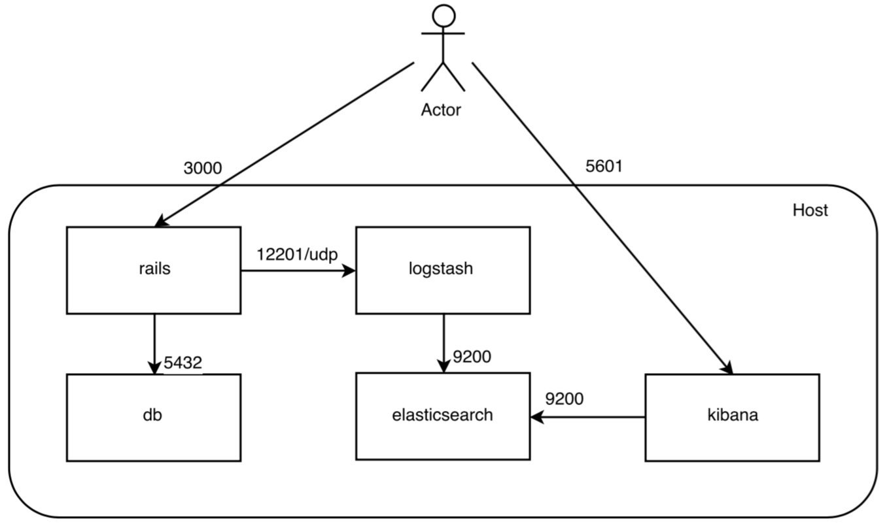

## Logging for Rails in Docker 

- Rails apps log to a `/log` folder within the container. this is problematic b/c: 
    - Logs will not be kept if rotated, or kept if container is recreated 
    - Accessing logs requires accessing the running container 
    - Creating multiple instances of app creates need for centralized storage for logs 
- Solutions 
    1. Mounted volume: mount host volume in `/app/log` in order to persist log files and access directly from host 
        - Rotation handled externally via logrotate configs using `copytruncate` strategy (avoids signallin the running Rails process)
    2. Logging drivers 
        - Provided by Docker out of the box 
        - JSON file default 
        - Alt: `syslog`, `journald`, `gelf`, `fluentd`, `awslogs`
        - `json-file` default logging driver won't rotate unless explicitly configured 
        - Need to route Rails logs ot standard output rather than local file, b/c Docker manages logs to`STDOUT`.
- Tuning Rails app 
    - Simple: set Rails logger to `STDOUT`, redirecting all log entries to Docker logging driver 
    ```Ruby
    config.logger = Logger.new(STDOUT)
    ```
    - Gem `lograge` reformats logs for easier parsing and redirects to `STDOUT` automatically 
        - Add `lograge` gem and set 
        ```Ruby
        config.lograge.enabled = true 
        ```



*Image via AnjLab - "How to set up ELK for Rails log management using Docker and Docker Compose"*

#### Sources: 
- [Logging for Rails apps in Docker - Santiago Palladino](https://manas.tech/blog/2015/12/15/logging-for-rails-apps-in-docker.html)
- [Docker docs - configuring logging drivers](https://docs.docker.com/config/containers/logging/configure/)
- [How to set up ELK for Rails log management using Docker and Docker Compose](https://medium.com/@AnjLab/how-to-set-up-elk-for-rails-log-management-using-docker-and-docker-compose-a6edc290669f)
